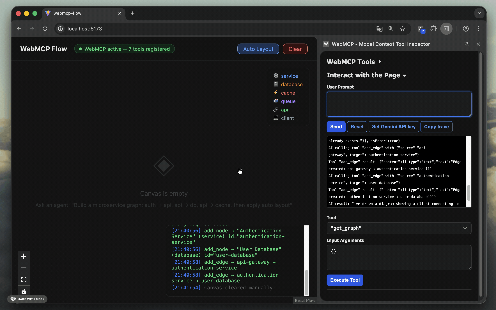

# WebMCP Flow

🚀 Live Demo: https://webmcp-flow.vercel.app/



An AI-controllable architecture diagram builder built on top of **WebMCP** — Chrome's browser-native agent protocol. Describe a system in plain text and watch the diagram build itself in real time.

## WebMCP Tools

The application exposes the following tools via `document.modelContext`:

- `add_node` — add a node with a label and type (`service`, `database`, `cache`, `queue`, `api`, `client`)
- `add_edge` — connect two nodes with an optional protocol label
- `remove_node` — delete a node and its connected edges
- `update_node` — rename or retype an existing node
- `get_graph` — read the current state of the diagram
- `clear_graph` — reset the canvas
- `auto_layout` — arrange nodes into a readable left-to-right layout

## How It Works

Each tool dispatches a `CustomEvent` to the React app and waits for a completion event before returning — giving the agent accurate feedback on every action. The graph state is kept in a module-level store that tools read directly, with no coupling to React internals.

## Tech Stack

- **React + TypeScript** (Vite)
- **[@xyflow/react](https://reactflow.dev/)** — node-based graph rendering
- **WebMCP** — `document.modelContext` for tool registration

## Requirements

WebMCP is available as an [Origin Trial](https://developer.chrome.com/origintrials/#/register_trial/4163014905550602241) from Chrome 149 through 156. Use either:

- **Chrome 149+** with a valid Origin Trial token, **or**
- **Chrome 149+** with `chrome://flags/#enable-webmcp-testing` enabled (local development)
- [Model Context Tool Inspector](https://chromewebstore.google.com/detail/model-context-tool-inspec/gbpdfapgefenggkahomfgkhfehlcenpd) extension

> **Note:** The API moved from `navigator.modelContext` to `document.modelContext` in Chrome 150, and `unregisterTool()` was removed in favor of unregistering via `AbortSignal`. This app targets the current `document.modelContext` API and falls back to `navigator.modelContext` for feature detection on older builds. See the [WebMCP docs](https://developer.chrome.com/docs/ai/webmcp/imperative-api).

## Getting Started

```bash
npm install
npm run dev
```

Open `http://localhost:5173` in Chrome with the WebMCP flag enabled.

## Example Prompt

> Draw a typical web application architecture with authentication: browser client, API Gateway, Auth Service, User Service, PostgreSQL, Redis. Connect them with edges labeled by protocol and apply auto layout.
